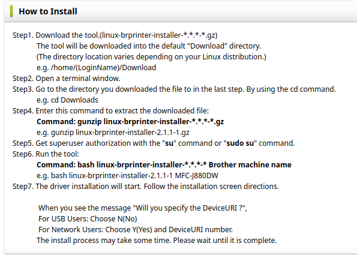

# Detailed Explanation of the Script

This bash script automates the process of downloading, extracting, and installing a Brother printer driver. 

## Purpose  

I wrote the script to correct the non working  set of instructions  by 
https://www.brother.co.uk/

Their instructions were as follows 

- `Step1`. 
    - Download the tool.(linux-brprinter-installer-*.*.*-*.gz)`
    - The tool will be downloaded into the default "Download" directory.
(The directory location varies depending on your Linux distribution.)
e.g. /home/(LoginName)/Download

- `Step2`. 
    - Open a terminal window.
- `Step3`. 
    - Go to the directory you downloaded the file to in the last step. By using the cd command.
    - e.g. cd Downloads

- `Step4`. 
    - Enter this command to extract the downloaded file:
    - Command: gunzip linux-brprinter-installer-*.*.*-*.gz
    - e.g. gunzip linux-brprinter-installer-2.1.1-1.gz

- `Step5`. 
    - Get superuser authorization with the "su" command or "sudo su" command.

 - `Step6`. 
- Run the tool:
    - Command: bash linux-brprinter-installer-*.*.*-* Brother machine name
e.g. bash linux-brprinter-installer-2.1.1-1 MFC-J880DW

- `Step7`.
- The driver installation will start. Follow the installation screen directions.
-  When you see the message "Will you specify the DeviceURI ?",
-   For USB Users: Choose N(No)
-   For Network Users: Choose Y(Yes) and DeviceURI number.

The install process may take some time. Please wait until it is complete.

### What did I notice 

- They dont tell you have to chmod +x the file 
- They then dont tell you how to run the command correctly either so of course the instructions  just do not work ,  bearing in mind this is a major PLC group   selling you printers along with all thier retailers and I can picture every client  going back and having a go at the retailers whom are none the wiser and wont have a clue 

## Decision time  

###  Time to  rewrite a decent bash script for linux that  actually works and does more than just this  saving you   time with typing in one conmand after another only to find out that its doesnt work 

### Below is a screen dump of thier intructions  because guranteed they will deny all knowledge of this remove this  suggesting that we are making this up 




## The new Bash Script and what this does 

## Define Variables
```
INSDIR="Brother"
```
- Sets the variable INSDIR to Brother, which will later be used to define a directory where the driver file will be stored (~/Brother).

## Print Header Message

```
echo "Brother Printer Driver Script MD Harrington London Kent DA6 8NP"
echo "https://github.com/markh2024?tab=repositories"
echo "Please wait ..."

```

- Displays a header with some information about the script and a GitHub repository link. 
- Provides a message indicating the script is starting.


## Pause Execution

```
sleep 5
```
- Pauses the script for 5 seconds to give the user time to read the header.

##  Display Information About the Process

```
echo "About to open webpage for Brother Printer drivers. Go to the Utilities section."
echo 
echo "Select your Operating System version i.e., Linux, Windows, or Mac." 
echo 
echo "After downloading the Printer driver installer tool, please answer yes, no, or quit to the next question."
```
- Informs the user that a webpage will be opened and provides instructions on what to do next.

##  Check for a Browser and Open the Brother Drivers Page

```
if command -v firefox &> /dev/null; then
    firefox https://www.brother.co.uk/support/drivers &
elif command -v xdg-open &> /dev/null; then
    xdg-open https://www.brother.co.uk/support/drivers &
else
    echo "Error: No compatible browser found. Please visit the URL manually."
    exit 1
fi

```

- Checks if Firefox or a generic browser opener (xdg-open) is available.
- Opens the Brother support page using the available browser.
- If no browser is found, prints an error and exits the script.
  
## Wait for User Confirmation of Download

```
while [ ! -f "$HOME/Downloads/linux-brprinter-installer-2.2.4-1.gz" ]; do
    read -p "Has the download completed for the printer driver installation tool? (yes/quit): " DOWNLOAD_STATUS
    case "$DOWNLOAD_STATUS" in
        yes)
            break
            ;;
        quit)
            echo "Exiting script."
            exit 0
            ;;
        *)
            echo "Invalid input. Please enter yes or quit."
            ;;
    esac
done

```

- Waits for the user to confirm that the file linux-brprinter-installer-2.2.4-1.gz has been downloaded to the ~/Downloads directory.
- Offers the option to quit the script or proceed.
- If the file is not found and the user does not confirm, the loop continues.

## Create Installation Directory

```
if [ ! -d "$HOME/$INSDIR" ]; then
    mkdir "$HOME/$INSDIR"
fi

```

- Checks if the directory ~/Brother exists. If not, it creates the directory.

## Move Driver File to Installation Directory

```
if [ -f "$HOME/Downloads/linux-brprinter-installer-2.2.4-1.gz" ]; then
    mv "$HOME/Downloads/linux-brprinter-installer-2.2.4-1.gz" "$HOME/$INSDIR/"
else
    echo "Error: linux-brprinter-installer-2.2.4-1.gz not found in Downloads."
    exit 1
fi

```

- Moves the driver file from the ~/Downloads directory to the ~/Brother directory.
- Exits with an error if the file is not found.
  
## Check for gunzip and Install It if Missing

```
if ! command -v gunzip &> /dev/null; then
    echo "Installing gzip utility..."
    sudo apt update && sudo apt install -y gzip
fi

```

- Verifies if the gunzip command is available.
- Installs the gzip package if gunzip is not installed.

##  Change to Installation Directory

```
cd "$HOME/$INSDIR" || exit 1

```

- Changes the working directory to ~/Brother.
- Exits with an error if the directory change fails.

## Extract the Driver File

```
if [ -f "linux-brprinter-installer-2.2.4-1.gz" ]; then
    gunzip "linux-brprinter-installer-2.2.4-1.gz"
else
    echo "Error: linux-brprinter-installer-2.2.4-1.gz not found in installs."
    exit 1
fi

```

- Unzips the linux-brprinter-installer-2.2.4-1.gz file if it exists.
- Exits with an error if the file is not found.
  
## Remove the .gz File

```
rm -f "linux-brprinter-installer-2.2.4-1.gz"
```

- Deletes the compressed .gz file after extraction.
  
## Make the Installer Executable

```
chmod +x "linux-brprinter-installer-2.2.4-1"
```

- Grants execute permissions to the extracted installer file.

## Run the Installer

```
read -p "Enter your printer model (e.g., DCP-T220): " PRINTER_MODEL
sudo ./linux-brprinter-installer-2.2.4-1 "$PRINTER_MODEL"

```

- Prompts the user to enter their printer model.
- Runs the installer script with the entered printer model as an argument using sudo.
  
##  Return to the Home Directory
```
cd ~ || exit 1

```

- Changes the working directory back to the user's home directory.

## Display Final Message

```
clear
echo -e "Printer driver should now be installed on your machine\n"
echo -e "Thank You  MD Harrington  London Kent DA6 8NP"
echo -e "Current date and time: $(date)"
```
- Clears the terminal screen.
- Displays a final success message, a thank-you note, and the current date and time.

## Summary 

This script guides the user through the process of downloading, extracting, and installing a Brother printer driver on a Linux system. It ensures prerequisites are met, provides clear instructions, and automates most steps to simplify the installation.


